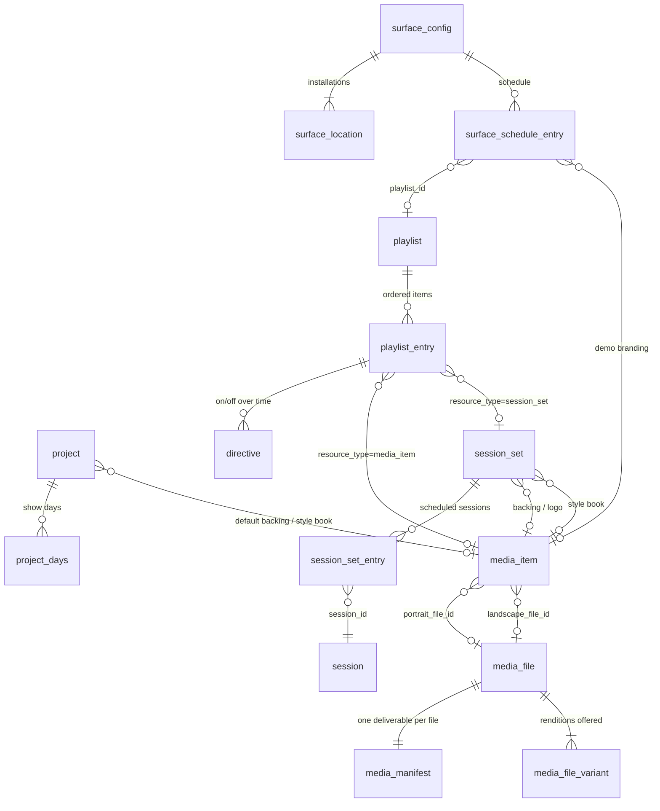
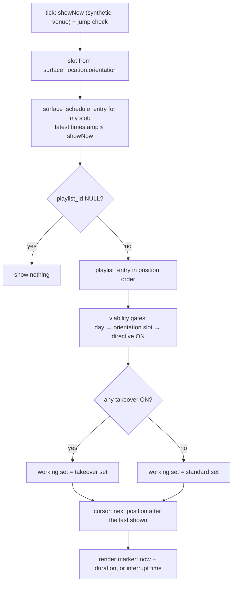
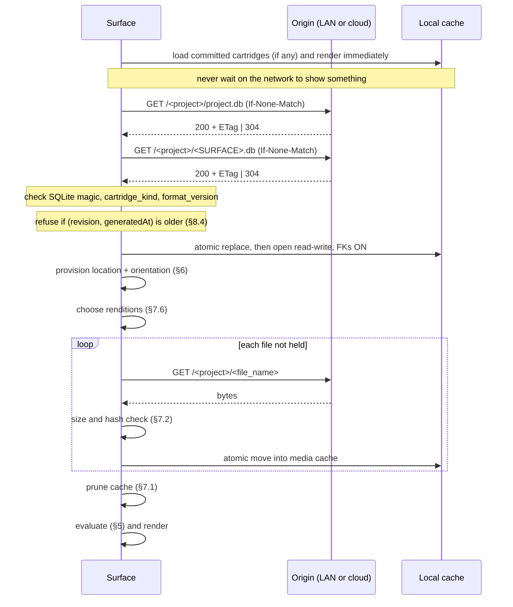

# Marquee Cartridge Specification — v25.0.1

**The delivered-artifact contract for Marquee digital signage.** Marquee Studio publishes a
Show as self-contained SQLite *cartridges*. A Surface fetches them, resolves what belongs on
screen from them, and renders. This document specifies those artifacts, and the rules for
interpreting them, precisely enough to build a Surface on any platform.

### Status

**v25.0.1 — draft, greenfield.** This version replaces the pre-v25 format in full. It is not
backward compatible with cartridges from the legacy web Studio, which is a separate, retired
product that continues to serve its existing shows unchanged. A v25.0.1 Surface reads v25.0.1
cartridges only.

From v25.0.1 onward the format evolves **additively** under the compatibility contract (§10),
so a cartridge published this year opens in a Surface written next year.

> **Repository note.** `example/` and `player/` implement the pre-v25 rules and will be
> updated to v25.0.1. Until then, treat this document as authoritative wherever they differ.

### Relationship to the internal platform specification

The on-screen behavior in §5 and §8 restates the rules of Marquee's internal platform
specification for external implementers. The two change together, and this document is complete
on its own: nothing here requires access to the Reference.

---

# Client Implementer's Guide

**Audience:** developers building a Marquee Surface — Apple, web, Android, Linux/embedded,
set-top, signage SoC.

**Scope:** the *delivered artifacts* — the two SQLite files a Surface fetches and the media
they name — and the rules for turning them into what is on screen. This is **not** the Marquee
authoring schema. An authoring database has tables and columns a cartridge never carries, and
a Surface must never assume it can read one.

## Terms

| Term | Meaning |
|---|---|
| **Show** | The authored event. Also called the project; the two words name one thing. |
| **Studio** | The authoring application family (macOS, iPad, Web). The only producer of cartridges. |
| **Surface** | Any device that conforms to this specification and renders a delivered cartridge. |
| **Cartridge** | A delivered, self-contained, immutable SQLite artifact. |

---

## 1. The shape of the system

A **Show**, identified by its `projectCode` (the *show code*, e.g. `SHOW26`), publishes a flat
keyspace:

```
<base>/<projectCode>/project.db           ← the project cartridge (always present)
<base>/<projectCode>/<SURFACECODE>.db     ← one surface cartridge per surface config
<base>/<projectCode>/<file_name>          ← media bytes, flat, UUID-named
```

A Surface is configured with a **three-level address**:

| Level | Example | Meaning |
|---|---|---|
| `projectCode` | `SHOW26` | Which Show — finds the keyspace |
| `surfaceCode` | `LOBBY3` | Which cartridge — names the `.db` |
| `locationId` | `LOBBY3-A` | Which physical installation — chosen at provisioning (§6) |

A Surface with no surface code uses `project.db` alone and shows the Show's wallpaper and
date/time. A Surface with a surface code pulls **both** files: `project.db` is the project
descriptor, and the surface cartridge carries the schedule and everything it plays.

The surface code `PROJECT` is reserved.

---

## 2. Byte-level facts

- Both artifacts are **plain single-file SQLite 3 databases**. No WAL, no `-shm`/`-wal` sidecars.
- Open **read-write** if you add your own runtime tables (for example, file-availability
  bookkeeping). Adding tables is safe; Studio never reads a cartridge back.
- **Never migrate a cartridge.** It is a delivered artifact, not a database you own.
- **Open with foreign keys ON.** Studio guarantees a clean `PRAGMA foreign_key_check` on every
  cartridge. If yours fails, the file is damaged: do not commit it over the copy you hold.
- Row `id`s are **preserved from the authoring database**. They are stable across republishes
  and safe to use as cache keys. IDs are only meaningful within one Show.
- Timestamps are **Unix milliseconds, INTEGER**. Durations and trim offsets are **seconds, REAL**.
- Booleans are `INTEGER` `0`/`1`.

### 2.1 Identifying an artifact

Both artifacts carry exactly one `cartridge_meta` row (§4.1):

- `cartridge_kind` is `'project'` or `'surface'`.
- `format_version` is the specification version the cartridge was written against, e.g.
  `'25.0.1'`. A Surface accepts any cartridge whose `format_version` has the same **first
  component** as its own (`25`), and applies §10 to anything newer within it. A different first
  component is a different format: refuse it and say so.

Authoring migration history (`grdb_migrations`) is **not** carried. It describes the author's
database, not the wire format.

---

## 3. Which tables are in which artifact

### 3.1 `project.db` — the project cartridge

```
cartridge_meta      project        project_days
media_item          media_file     media_file_variant     media_manifest
```

It carries the Show's identity, timezone, days, wallpapers, and the media those need.

### 3.2 `<SURFACECODE>.db` — the surface cartridge

```
cartridge_meta      project        project_days
surface_config      surface_location       surface_schedule_entry
playlist            playlist_entry         directive
session             session_set            session_set_entry
media_item          media_file             media_file_variant     media_manifest
```

A surface cartridge also carries `project` and `project_days`, so a Surface can resolve time
without opening `project.db`. Its `project` row has `show_wallpaper_item_id` and
`desktop_wallpaper_item_id` **forced to NULL**: wallpapers live only in `project.db`, and a
pointer to media the surface cartridge does not carry would fail `foreign_key_check`.
Conversely, `project.db` carries `brand_style` but has `brand_style_item_id` and
`backing_item_id` **forced to NULL**: the style book and the backing ride in each surface
cartridge (§9, §5.10).

**Never present in either artifact** (authoring-only): `tag`, `tag_assignment`, `integration`,
`media_optimization`, `grdb_migrations`.

### 3.3 Entity relationships



---

## 4. Table reference

DDL below is the v25.0.1 wire format. Comments are normative.

### 4.1 `cartridge_meta` — both artifacts, exactly one row

```sql
CREATE TABLE cartridge_meta (
  cartridge_kind     TEXT    NOT NULL,   -- 'project' | 'surface'
  format_version     TEXT    NOT NULL,   -- e.g. '25.0.1'
  project_code       TEXT    NOT NULL,   -- the show code; roots the media keyspace
  surface_id         TEXT,               -- the surface code; NULL in project.db
  published_revision INTEGER NOT NULL,   -- monotonic per artifact
  timezone           TEXT    NOT NULL,   -- IANA venue timezone
  generated_at       INTEGER NOT NULL    -- Unix ms the artifact was produced
);
```

| Column | Notes |
|---|---|
| `cartridge_kind` | How to identify the file. `surface_id` is non-NULL exactly when this is `'surface'`. |
| `published_revision` | Monotonic per artifact: per surface config for a surface cartridge, per Show for `project.db`. Increments on every publish. |
| `timezone` | The **venue** timezone. The single authority for every time decision (§8). |

### 4.2 `media_manifest` — both artifacts, one row per media file

```sql
CREATE TABLE media_manifest (
  media_file_id         INTEGER NOT NULL UNIQUE REFERENCES media_file(id),
  deliverable_file_name TEXT    NOT NULL,   -- flat object key, §7.1
  content_hash          TEXT    NOT NULL,   -- 'sha256:…' of these bytes
  file_size             INTEGER NOT NULL,   -- bytes
  content_type          TEXT    NOT NULL
);
```

The complete list of bytes this artifact needs, with **one default deliverable per media
file**: the `optimized` rendition where one exists, else the original. The manifest is the only
place a deliverable name appears; `media_file` does not repeat it. A Surface that chooses a
different rendition does so from `media_file_variant` (§7.6).

### 4.3 `project`, `project_days`

```sql
CREATE TABLE project (
  id                        INTEGER PRIMARY KEY,
  cloud_uid                 TEXT    NOT NULL,
  name                      TEXT    NOT NULL,
  project_code              TEXT    NOT NULL,
  timezone                  TEXT    NOT NULL,
  show_wallpaper_item_id    INTEGER REFERENCES media_item(id),
  desktop_wallpaper_item_id INTEGER REFERENCES media_item(id),
  backing_item_id           INTEGER REFERENCES media_item(id),   -- default backing, §5.10
  brand_style               TEXT,     -- style address 'company/style/version', §9
  brand_style_item_id       INTEGER REFERENCES media_item(id),   -- the style book file, §9
  created                   INTEGER NOT NULL,
  updated                   INTEGER NOT NULL
);

CREATE TABLE project_days (
  id         INTEGER PRIMARY KEY,
  day        TEXT    NOT NULL UNIQUE,   -- 'YYYY-MM-DD', venue-local
  start_time INTEGER NOT NULL,          -- Unix ms, venue-local 00:00:00.000
  end_time   INTEGER NOT NULL,          -- Unix ms, venue-local 23:59:59.999
  created    INTEGER NOT NULL,
  updated    INTEGER NOT NULL
);
```

**`project_days` is not decoration.** It defines the event window, scopes directive evaluation
(§5.4), and anchors synthetic time (§8.2). Days are whole venue-local calendar days and may be
**non-contiguous** — a Show can skip a day. Order by `start_time`. Studio guarantees at least
one day.

### 4.4 `surface_config`, `surface_location`, `surface_schedule_entry`

```sql
CREATE TABLE surface_config (
  id                 INTEGER PRIMARY KEY,
  name               TEXT    NOT NULL,
  surface_id         TEXT    NOT NULL,   -- the surface code
  published_revision INTEGER NOT NULL,
  published_at       INTEGER NOT NULL,
  created            INTEGER NOT NULL,
  updated            INTEGER NOT NULL
);

CREATE TABLE surface_location (
  id          INTEGER PRIMARY KEY,
  config_id   INTEGER NOT NULL REFERENCES surface_config(id),
  location_id TEXT    NOT NULL UNIQUE,   -- globally unique real-world id
  orientation TEXT    NOT NULL,          -- 'portrait' | 'landscape' (the mount)
  label       TEXT,
  created     INTEGER NOT NULL,
  updated     INTEGER NOT NULL
);

CREATE TABLE surface_schedule_entry (
  id                 INTEGER PRIMARY KEY,
  config_id          INTEGER NOT NULL REFERENCES surface_config(id),
  slot               TEXT    NOT NULL,   -- 'portrait' | 'landscape' | 'demo_station'
  timestamp          INTEGER NOT NULL,   -- most-recent <= now wins, per slot
  playlist_id        INTEGER REFERENCES playlist(id),
  background_item_id INTEGER REFERENCES media_item(id),   -- demo branding (behind)
  overlay_item_id    INTEGER REFERENCES media_item(id),   -- demo branding (front)
  created            INTEGER NOT NULL,
  updated            INTEGER NOT NULL,
  CHECK (
    ( slot IN ('portrait','landscape')
        AND background_item_id IS NULL AND overlay_item_id IS NULL )
    OR
    ( slot = 'demo_station'
        AND ( background_item_id IS NOT NULL OR overlay_item_id IS NULL ) )
  )
);
```

A surface cartridge carries **exactly one** `surface_config` row — its own — and **at least
one** `surface_location` row. Every location shares the config's cartridge.

### 4.5 `playlist`, `playlist_entry`, `directive`

```sql
CREATE TABLE playlist (
  id              INTEGER PRIMARY KEY,
  name            TEXT    NOT NULL,
  created         INTEGER NOT NULL,
  updated         INTEGER NOT NULL
);

CREATE TABLE playlist_entry (
  id                   INTEGER PRIMARY KEY,
  playlist_id          INTEGER NOT NULL REFERENCES playlist(id),
  position             INTEGER NOT NULL,                  -- authored order
  resource_type        TEXT    NOT NULL,                  -- 'media_item' | 'session_set'
  media_item_id        INTEGER REFERENCES media_item(id),
  session_set_id       INTEGER REFERENCES session_set(id),
  start_time_portrait  REAL,
  end_time_portrait    REAL,
  start_time_landscape REAL,
  end_time_landscape   REAL,
  created              INTEGER NOT NULL,
  updated              INTEGER NOT NULL,
  CHECK (resource_type <> 'media_item'  OR media_item_id  IS NOT NULL),
  CHECK (resource_type <> 'session_set' OR session_set_id IS NOT NULL)
);

CREATE TABLE directive (
  id        INTEGER PRIMARY KEY,
  entry_id  INTEGER NOT NULL REFERENCES playlist_entry(id),
  type      TEXT    NOT NULL,   -- 'standard' | 'takeover'
  timestamp INTEGER NOT NULL,
  on_screen INTEGER NOT NULL,
  timezone  TEXT,               -- authoring context only; never evaluated
  created   INTEGER NOT NULL,
  updated   INTEGER NOT NULL
);
```

**Studio-player runtime modifiers are not in the wire format.** Studio's operator-controlled
player has live-mode controls (looping, pause on entry or completion, disabling an entry,
shuffle, seamless video). They govern a human operator's playback, not scheduled rules, so
Studio strips them at publish. A Surface decides what is on screen from the schedule and
directives only.

### 4.6 `media_item`, `media_file`

```sql
CREATE TABLE media_item (
  id                INTEGER PRIMARY KEY,
  name              TEXT    NOT NULL,
  portrait_file_id  INTEGER REFERENCES media_file(id),
  landscape_file_id INTEGER REFERENCES media_file(id),
  display_duration  REAL,                                 -- seconds, stills
  brand_member      TEXT,                                 -- style address, §9; NULL = not brand
  created           INTEGER NOT NULL,
  updated           INTEGER NOT NULL,
  CHECK (portrait_file_id IS NOT NULL OR landscape_file_id IS NOT NULL)
);

CREATE TABLE media_file (
  id                 INTEGER PRIMARY KEY,
  content_type       TEXT    NOT NULL,   -- MIME of the imported file
  codec              TEXT,               -- what the imported file needs to decode
  width              INTEGER,
  height             INTEGER,
  orientation        TEXT,               -- advisory
  aspect_ratio       REAL,               -- advisory
  intrinsic_duration REAL,               -- seconds, video
  created            INTEGER NOT NULL,
  updated            INTEGER NOT NULL
);
```

A **`media_item` is the orientation-independent thing Studio schedules.** It holds up to two
`media_file`s, one per orientation, and the Surface picks by the orientation it renders (§5.7).
At least one is always present.

A **`media_file` describes the imported asset.** `content_type` is the MIME type of the file as
imported; the types of its renditions live in `media_file_variant`. Deliverable names live only
in `media_manifest` and `media_file_variant`.

### 4.7 `session`, `session_set`, `session_set_entry`

```sql
CREATE TABLE session (
  id          INTEGER PRIMARY KEY,
  name        TEXT    NOT NULL,
  abstract    TEXT,
  presenters  TEXT,               -- JSON array
  attributes  TEXT,               -- JSON array
  source_id   TEXT,
  source_type TEXT,
  source_name TEXT,
  created     INTEGER NOT NULL,
  updated     INTEGER NOT NULL
);

CREATE TABLE session_set (
  id                INTEGER PRIMARY KEY,
  name              TEXT    NOT NULL,
  render_modes      TEXT    NOT NULL DEFAULT '["simple"]',   -- JSON array
  duration          REAL    NOT NULL DEFAULT 8,              -- seconds per board page
  backing_item_id   INTEGER REFERENCES media_item(id),
  logo_item_id      INTEGER REFERENCES media_item(id),
  schedule_template TEXT,               -- JSON diff vs the Surface baseline; NULL = baseline
  source_id         TEXT,
  source_name       TEXT,
  brand_style         TEXT,                               -- overrides the project's, §9
  brand_style_item_id INTEGER REFERENCES media_item(id),  -- overrides the project's, §9
  created           INTEGER NOT NULL,
  updated           INTEGER NOT NULL
);

CREATE TABLE session_set_entry (
  id              INTEGER PRIMARY KEY,
  session_set_id  INTEGER NOT NULL REFERENCES session_set(id),
  session_id      INTEGER NOT NULL REFERENCES session(id),
  session_time_id TEXT,
  start_time      INTEGER NOT NULL,
  end_time        INTEGER NOT NULL,
  source_room_id  TEXT,
  room_name       TEXT,
  created         INTEGER NOT NULL,
  updated         INTEGER NOT NULL
);
```

A playlist entry with `resource_type = 'session_set'` puts a **session board** on screen: the
room's sessions as text, composited over a backing (§5.10). `logo_item_id` is part of the board's
content, placed by the board's layout. Session boards are
**required** on every Surface. The cartridge carries content and branding pointers, not a
layout: board design is a product decision per Surface platform.

### 4.8 `media_file_variant` — the renditions offered

```sql
CREATE TABLE media_file_variant (
  id            INTEGER PRIMARY KEY,
  media_file_id INTEGER NOT NULL REFERENCES media_file(id),
  kind          TEXT    NOT NULL,   -- 'original' | 'optimized' | 'webOptimized' | 'wifiOptimized' | …
  file_name     TEXT    NOT NULL,   -- flat object key, §7.1
  content_type  TEXT    NOT NULL,
  codec         TEXT,               -- required for video
  width         INTEGER,
  height        INTEGER,
  file_size     INTEGER NOT NULL,
  content_hash  TEXT    NOT NULL,   -- 'sha256:…' of THESE bytes
  created       INTEGER NOT NULL,
  updated       INTEGER NOT NULL
);
```

Every media file has at least its `original` row. Ignore any `kind` you do not recognize.

| `kind` | What it is |
|---|---|
| `original` | The file as imported. |
| `optimized` | The venue master — visually lossless, Apple-native (HEVC video, HEIC stills). |
| `webOptimized` | Browser-universal — H.264 up to 1080p, JPEG or PNG stills. |
| `wifiOptimized` | A smaller Apple-native rung for a weak uplink. Video only; not every video has one. |

`codec` names what a Surface must **decode** (`HEVC`, `H.264`, `ProRes`; `HEIC`, `JPEG`, `PNG`,
`WebP`). It is the column to choose on: for video, `content_type` does not say whether a
`video/mp4` holds HEVC or H.264.

---

## 5. What is on screen

This is the part to get right. Everything else is plumbing.

A Surface runs a loop driven by the display (DisplayLink on Apple, `requestAnimationFrame` in a
browser, the equivalent elsewhere). Each tick samples two clocks (§8.1) and passes the pair
through the whole evaluation, so every decision in a tick sees the same instant. Nothing may
depend on a tick arriving at a particular moment: a throttled or late tick simply catches up.



### 5.1 Pick the slot

The **rendered slot** is `portrait` or `landscape`, taken from the `orientation` of this
installation's `surface_location` (§6). `demo_station` is a parallel mode slot (§5.11), never
an alternative to these.

Re-resolve the schedule **immediately** whenever the rendered slot changes.

### 5.2 Pick the schedule entry

Within the slot, the **most recent entry whose `timestamp ≤ showNow` wins**. Entries are a
timeline of changeovers, not windows: there is no end time.

```sql
SELECT * FROM surface_schedule_entry
 WHERE config_id = :config AND slot = :slot AND timestamp <= :showNow
 ORDER BY timestamp DESC LIMIT 1;
```

- A `playlist_id` of NULL means **show nothing from now**. Clear the active playlist.
- The **next schedule boundary** is the earliest `timestamp > showNow` across the rendered slot
  and `demo_station`. It is an interrupt time (§5.9).
- When the active playlist changes, cut immediately and reset both rotation cursors (§5.6).

### 5.3 The viability pass

Run it each time the current content ends, always against the show clock. It is a sequence of
**gates**, cheapest first; an entry that fails a gate is excluded and never reaches the next one.

1. **Day gate.** Once per pass, find the `project_days` row containing `showNow` (§5.4). It scopes
   every directive evaluated below to the current day. Outside every day, the whole timeline
   participates.
2. **Orientation gate.** For each `playlist_entry` of the active playlist, in `position` order: a
   `media_item` entry passes only if its item has a file in the slot for the playlist orientation
   (§5.7). An empty slot is an intentional exclusion, so the entry's directives are **never
   evaluated**. A `session_set` entry passes if the set is present.
3. **Directive gate.** Find the governing directive of each type within the current day (§5.4).
   The entry joins the **takeover set** if its governing `takeover` directive is ON, and the
   **standard set** if its governing `standard` directive is ON. It may join both.

**An entry needs an ON directive to be viable.** An entry with no directive of a type is not ON
for that type, and an entry with no ON directive of either type never appears. Cartridges also
deliver media used outside playlists (wallpapers, backings, branding); being delivered never
makes anything viable.

### 5.4 Directives — the on/off timeline

A directive is a **state change**, not a window. For one entry, one type, at `showNow`:

1. Find the `project_days` row where `showNow BETWEEN start_time AND end_time`.
2. Take that entry's directives of that type with `timestamp ≤ showNow`.
3. If a day was found, keep only directives whose `timestamp` falls inside that day.
4. The **latest** surviving directive governs. ON when its `on_screen` is 1.
5. If `showNow` falls outside every day, skip step 3.

```sql
SELECT * FROM directive
 WHERE entry_id = :entry AND type = :type AND timestamp <= :showNow
   AND (:dayStart IS NULL OR timestamp BETWEEN :dayStart AND :dayEnd)
 ORDER BY timestamp DESC LIMIT 1;
```

Day scoping is what makes directives day-part: yesterday's takeover cannot leak into today.
`directive.timezone` is authoring context; never evaluate it.

### 5.5 The working set: takeover beats standard

> **If the takeover set is non-empty, it IS the rotation.** The standard set is suppressed
> entirely — not appended, not interleaved.

- Several active takeovers form one set, in `position` order.
- **A takeover is self-providing.** While any viable takeover entry is ON, the takeover set owns
  the screen and the Surface never falls back to the standard set. A takeover entry with an empty
  slot for this orientation is excluded like any other entry (§5.7), so a takeover authored for one
  orientation does not take over the other. A takeover entry whose file fails to load is skipped
  within the takeover set (§5.13).
- **Empty standard set.** Keep the last frame up and run the viability pass again after 2 s
  of show time. Directive windows can legitimately empty the set for a moment.

### 5.6 Rotation: position cursors

Keep **two cursors**, each an authored `position`:

| Cursor | Tracks | Reset when |
|---|---|---|
| standard cursor | position of the last **standard** entry shown | active playlist changes; cartridge replaced |
| takeover cursor | position of the last **takeover** entry shown | active playlist changes; cartridge replaced; a takeover period begins |

The next entry is the first entry in the working set whose `position` is **greater than the
cursor**, wrapping to the first entry. With no cursor, start at the first entry.

- Advance by position — never by an index into the recomputed list (it skips entries when the
  list changes) and never by looking up the last entry's identity (it restarts at the top when
  that entry drops out).
- When a takeover period ends, the standard rotation resumes after the standard cursor: close to
  where it left off, even if that entry is now excluded.

### 5.7 Item → file, by orientation

```
portrait  → portrait_file_id     -- no fallback
landscape → landscape_file_id    -- no fallback
```

**The slot is the author's decision.** There is no fallback to the other orientation.

- An **empty slot** for the rendered orientation is an intentional exclusion: the entry is not
  viable on that orientation and is skipped (§5.3).
- **Whatever file is in the slot plays**, whatever its pixel shape. A landscape image placed in
  the portrait slot plays on a portrait Surface, as authored.
- Both slots may reference the same file.

The same rule applies to backings (an empty slot means no backing on that orientation) and to
`demo_station` branding. Then choose which rendition of the file to play (§7.6).

### 5.8 Start and duration

Each entry resolves to a **start** and a **duration**, in seconds, for the orientation being
rendered. They are the numbers Studio's editor shows, so a Surface following this rule shows
what the author saw.

| | Rule |
|---|---|
| **start** | `start_time_<orientation>`, else `0` |
| **duration** | `end_time_<orientation> − start` when the window has an end — for a still too, where it is the dwell. A video with no end: to the end of the clip. A still with no end: `media_item.display_duration`, else **8 s**. |

- For a video, start is the in-point and start + duration the out-point.
- A window counts only when `end > start`.
- A session board lasts `session_set.duration × pageCount`: each page gets the full duration.

### 5.9 When content ends: the render marker and interrupts

Everything on screen — a still, a video, a session board, a composite — is governed by **one
render marker**: a single timestamp on the show clock (§8.1). The render loop checks it on every
tick, and **any tick where `showNow ≥ marker` evaluates the next content.** That check is the only
place the next content is evaluated.

Each render item the viability pass produces carries a **next-render hint**:

| Hint | Marker |
|---|---|
| A **duration** (§5.8) | `showNow + duration`, read when the content's **first frame is on screen** |
| A **time** | that timestamp |

The viability pass gives a **time** hint when a known interrupt comes before the item's natural
end — the next takeover activation (below) is substituted for the duration.

**Setting the marker to 0 forces the next render loop to evaluate.** Use it for a show-clock jump,
a video completing its window, a skip after a load failure, a change of active playlist, a mode
change, and a newly committed cartridge.

For video, the hint is a watchdog — the duration, else `intrinsic_duration`, else 300 s, plus
10 s grace — or the interrupt time, whichever is earlier; the media completing its window sets
the marker to 0. One clip that never completes cannot park the rotation.

**Interrupts** — the only things that end content early:

| Interrupt | Effect |
|---|---|
| The working set changes from **standard to takeover** | Cut immediately to the takeover set's first entry |
| The schedule boundary passes (§5.2) | Cut; resolve the new playlist; reset cursors |
| The Surface's mode changes | Cut; enter the new mode |
| The show clock jumps (§8.3) | Marker to 0; re-evaluate everything; cut |
| A new cartridge is committed | Reset all state; cut |

**Not interrupts** — these apply at the next viability pass, after the current content finishes
naturally:

- A standard directive turning on or off.
- A takeover directive turning off, including the end of a takeover period. The takeover item
  finishes its time; then the standard rotation resumes.
- An entry joining a takeover set that is already active.

Compute `interruptAt` during the viability pass: while the working set is standard, it is the
earliest future `takeover` directive turning ON for an entry of the active playlist. The schedule
boundary is checked separately in the render loop (`showNow ≥` next boundary); a changed playlist
sets the marker to 0.

The standard → takeover transition always cuts and starts the takeover set at its first entry,
even when the entry on screen is also in the new takeover set.

**Never disarm.** Every path out of an evaluation — success, skip, load failure, empty set —
leaves the marker armed: 0 to skip to the next entry, or `showNow + 2 s` for an empty set.

### 5.10 Composition: backing, content, overlay

Content is layered, bottom to top:

| Layer | Holds |
|---|---|
| Backing | Media behind content — supports transparent content |
| Content | The entry's media, or a session board (text and logo) |
| Demo overlay | In demo mode only: `demo_station` branding in front (§5.11) |

A **session board is text**: it composites over its backing to complete what is on screen.

**The backing is set at the project level, with an override for session boards.** A backing is
a `media_item`, resolved to a file by orientation (§5.7), and may be a still or a video.

| Content | Backing |
|---|---|
| Session board | `session_set.backing_item_id` if set → `project.backing_item_id` → none |
| Media item | `project.backing_item_id` → none |

- A composite has **one duration**: the content's (§5.8). A still backing holds for as long as
  the content is up; a video backing loops for as long as the content is up, and its loop never
  advances the rotation.
- An interrupt ends the composite as a whole, including a multi-page board mid-board.

### 5.11 The `demo_station` slot

`demo_station` is resolved the same "latest ≤ now" way, in parallel with the rendered slot. Its
`CHECK` constraint encodes the rules:

- `portrait` / `landscape` entries carry **only** a playlist — never branding.
- `demo_station` entries carry branding (`background_item_id`, optional `overlay_item_id`) and
  **may** carry a `playlist_id` — picture-in-picture content, rendered at the **opposite**
  orientation to the host, under the rules of this section unchanged.
- An all-NULL `demo_station` entry means **demo off**.

Identify a demo entry by its `slot`. Demo presentation is a Surface implementation choice; a
Surface that does not implement demo mode ignores the slot entirely.

### 5.12 Content types

`media_file.content_type` and `media_file_variant.content_type` are MIME types. Studio imports
`image/png`, `image/jpeg`, `image/webp`, `image/heic`, `video/mp4`, `video/quicktime`, and
`video/x-m4v`, and produces renditions in the types of §4.8.

- **Treat any `image/*` you can decode as an image and any `video/*` you can decode as a video.**
  Do not hard-code an allow-list.
- Choose renditions on `codec` (§7.6).
- When you genuinely cannot decode something, name the file and type loudly enough that an
  operator sees it without reading a device log.

### 5.13 Failure handling: skip and warn

- One bad reference, missing file, failed decode, or oversize asset never stops playback. Log the
  entry, skip it, re-arm.
- **Downscale oversize assets; never skip them.** Keep a hard texture ceiling (the reference
  client uses 3840 px on the long edge) and say so at notice level when you scale.
- Brand assets in a playlist are an authoring error: skip them loudly.
- **Never let the render path wait on a database or the network.** Snapshot the cartridge into
  memory, with its indexes, when it is committed.

---

## 6. Provisioning

A surface cartridge describes one or more **installations** of the same surface config: its
`surface_location` rows. They all play the same cartridge; each is tracked by its `location_id`.

On first run:

1. Read the cartridge's `surface_location` rows.
2. Pick one — present the list (`label`, `orientation`), or take the only one.
3. **Persist the chosen `location_id`.**
4. Adopt that location's `orientation` as the rendered slot.

On later runs, keep the stored `location_id` **only while the cartridge still lists it**. If it is
gone, re-pick. Clear the stored `location_id` whenever the configured `projectCode` or
`surfaceCode` changes.

Provide a manual orientation override for the operator. It takes effect immediately (§5.1). When
a later publish changes the adopted location's orientation, adopt the new value — but do not
overwrite a manual override on a republish that did not change it.

---

## 7. Media

### 7.1 Addressing

```
<mediaBase>/<projectCode>/<file_name>
```

Flat, per Show. `file_name` is the manifest's `deliverable_file_name`, or the `file_name` of the
rendition you chose (§7.6); renditions live in the same keyspace. Names are UUID-unique and
immutable — a re-encode mints a new name — so **presence by name is a sufficient "already have
it" check**. Cache on name.

Prune your cache against **what you play plus what you are still fetching**: the manifests of the
cartridges you hold, each file replaced by the rendition you chose, plus any rendition still
downloading.

### 7.2 Integrity

Every manifest row and every rendition carries `file_size` and `content_hash`. Verify every file
before use:

1. Downloaded length differs from `file_size` → **reject** as a truncated transfer; retry.
2. SHA-256 differs from `content_hash` → **reject** as wrong bytes at that address; retrying will
   not help.

Report the two failures with **different** messages. Verify a rendition against its **own** hash
and size, never its parent file's.

A missing or rejected file degrades the media count; it never fails the bootstrap. Remember what
failed and retry on later passes.

### 7.3 Resumable fetching (recommended)

The origin answers ranged GETs (`206`, `Accept-Ranges: bytes`, `Content-Range`, `ETag`). If you
resume:

1. **Store the origin's `ETag` beside the partial, and write it before the bytes it describes.**
2. **No validator, or a mismatched one → discard and start clean.** Never append to bytes whose
   identity you cannot prove.

Keep partials outside the directory your renderer resolves media from.

### 7.4 Renderer limits

`media_file.width` / `height` and the rendition's own dimensions are intrinsic pixels. Assets
larger than your renderer can texture are legitimate: downscale them (§5.13).

### 7.5 Brand assets

Typefaces and the style book are delivered through the manifest like media, but they are **not
decoded as media** and never choose among renditions. Take them exactly as the manifest names
them. Their use is specified in §9.

### 7.6 Choosing a rendition

A Surface may download a rendition in place of the manifest's default deliverable. The first one
it can decode wins:

1. `wifiOptimized`, **if the device is set to prefer it.** A weak uplink is a fact about where a
   device is installed, not about the Show, so this is a device setting.
2. **The venue master: `optimized` when the file has one, else `original`.**
3. `webOptimized`.
4. `original`, as a last resort.

**A browser Surface puts `webOptimized` first**, and treats HEVC as undecodable unless it has
probed the platform. H.264, JPEG, PNG, and WebP are the browser-safe set.

Rules that make the order safe:

- **Decide on `codec`.** A video rendition without a `codec` is not known to be decodable.
- **Render only what you hold, and prune from the same decision you render from.**
- **When nothing offered for a file decodes,** keep the manifest's deliverable and report the file
  and the codecs it offered. Never hold fewer files than the cartridge shipped.

**Play what you hold.** The order above is what to fetch when you hold nothing for a file.

- **Tiers, highest first:** master (`optimized`, `original`) › `wifiOptimized` › `webOptimized`.
  A browser Surface ranks `webOptimized` first.
- **Going down a tier needs no download.** Holding a verified rendition at or above the preferred
  tier, keep playing it.
- **Going up a tier replaces once the new bytes are verified.** Keep playing what you hold until
  then; if the fetch fails, nothing playable is lost.
- A held rendition counts only if you can decode it and the current cartridge still offers it.

---

## 8. Time

### 8.1 One timeline

Every time-based decision runs on the **show clock** (§8.2): the schedule, directives, day
scoping, session board now/next, **and the render marker** (§5.9).

The device's **monotonic clock** — `CACurrentMediaTime` or equivalent on Apple,
`performance.now()` in a browser — has one job: detecting show-clock jumps (§8.3). It never
decides content and never times it.

All `timestamp`, `start_time`, and `end_time` values are absolute Unix ms, so comparisons are
timezone-free. The venue timezone (`cartridge_meta.timezone`) matters for the day projection
below and for presenting times. **The device's own timezone is never used.**

### 8.2 The show clock

A Surface always behaves as if it is **at the venue**.

```
showNow(realNow):
  eventStart = first project_days.start_time
  eventEnd   = last  project_days.end_time
  if eventStart ≤ realNow ≤ eventEnd:
      return realNow                                   # real venue time
  # outside the event: synthetic time
  tod       = time-of-day of realNow in the venue timezone
  synthetic = Day 1's date at tod, in the venue timezone
  clamp synthetic into [Day 1 start_time, Day 1 end_time]
  return synthetic
```

- Outside the event, a Surface **always simulates Day 1** at the venue's current time of day. A
  Surface in New York powered up the week before a Los Angeles Show shows, at 12:00 ET, what the
  sign will show at 09:00 PT on Day 1.
- Because days are whole venue-local days, the clamp is a guard, not a normal path.
- A local time that does not exist (daylight-saving gap) resolves to the next valid instant.
- **This is required behavior.** Viewing any other moment of the Show is a Studio preview
  function; a Surface has no preview mode.

### 8.3 Show-clock jumps

A **jump** is a show-clock move that real elapsed time cannot explain. Each tick, compare the show
clock's movement with the monotonic clock's movement since the previous tick. A move **backward**
by any amount (midnight outside the event window; real time crossing the event end onto Day 1), or
**forward by more than the elapsed real time** beyond 250 ms of noise (a wall-clock correction),
is a jump. **Every jump sets the render marker to 0**, so the next render loop re-evaluates
schedule, viability, and working set, and cuts (§5.9). Keep the rotation cursors unless the
active playlist changed.

Because days are whole venue-local days, the Day 1 clamp (§8.2) cannot engage, and a Surface's
show clock never holds still.

### 8.4 Freshness: when to re-pull

**Cloud (static bucket):** conditional GET on each cartridge. Store the `ETag`, send
`If-None-Match`, treat `304` as unchanged.

**LAN server:** a status document at `<base>/<projectCode>/<fileName>/status`:

```json
{ "projectCode": "SHOW26", "surfaceId": "LOBBY3", "isProjectOnly": false,
  "generatedAt": 1789340889665, "publishedRevision": 3, "mediaFileCount": 98 }
```

Poll every 30–60 s. **Compare for inequality, never for order**, and re-pull when either token
differs: `generatedAt` is a wall clock, not monotonic across machines.

**Refuse an older cartridge.** Before committing a pulled cartridge over the one you hold, compare
`(published_revision, generated_at)` lexicographically and keep the current one if the new one is
strictly older. Log the refusal.

### 8.5 Bootstrap



**Never replace a good cartridge with an unvalidated body.** A captive portal answers `200` with an
HTML login page. Check the 16-byte SQLite magic (`SQLite format 3\0`) and read `cartridge_meta`
before the swap — a zero-byte file is a valid empty database, so "it opens" is not enough.

---

## 9. Brand delivery

A Show — or one session set — can be branded with a **style book**: a published, versioned set of
typefaces and a style manifest (`style.json`). Surfaces use it to set type and colour on anything
they draw themselves, such as session boards. The contents of `style.json` are defined by the
Marquee branding specification (not public); this section covers how a style book reaches a Surface.

### 9.1 Columns

| Column | Meaning |
|---|---|
| `brand_style` (`project`, `session_set`) | **Provenance:** the style's portal address, `company/style/version`, e.g. `acme/acme-2026/3`. The version is pinned: a published version is immutable, so a republish can never silently restyle a signed-off Show. Not a reference; never resolved to a file. |
| `brand_style_item_id` (`project`, `session_set`) | **Resolution:** the `media_item` holding that address's `style.json`. |
| `media_item.brand_member` | The style address a media item belongs to. Every typeface and the style book itself carry it. |

### 9.2 Resolution

For anything a Surface draws in a session set's context:

```
style book = session_set.brand_style_item_id ?? project.brand_style_item_id ?? the Surface's built-in default
```

Everywhere else, the project's style book, then the built-in default.

### 9.3 Delivery

- **Brand files travel as ordinary media.** A Surface's media cache is a flat namespace pruned to
  the manifest, so a brand folder could not survive it. Studio imports each file as a
  `media_item` / `media_file` and rewrites the paths inside `style.json` to the deliverable names
  the files were given. A Surface resolves faces through the manifest it already holds.
- **Each surface cartridge carries every member of every style address it references** —
  selected by `brand_member`, since nothing else in the cartridge references a typeface.
- **Every platform's faces ship** (for example `.ttf` and `.woff2`). A cartridge is not addressed
  to one platform; a Surface uses the formats it needs and ignores the rest.
- `project.db` carries `brand_style` only; the style book rides in the surface cartridges (§3.2).

### 9.4 Rules for a Surface

- Fetch and verify brand files like any file (§7.2). Never decode them as media and never choose
  renditions for them (§7.5).
- A `brand_member` item is never playable and never viable. One found in a playlist is skipped
  loudly (§5.13).
- If a referenced style book fails to load, fall back to the next step of §9.2 and say so; never
  render nothing.

---

## 10. The compatibility contract

> **A record that reads a delivered artifact is a WIRE FORMAT, not a schema.**

The DDL in §4 is the **v25.0.1 baseline**. Every baseline column is present in every v25
cartridge. From here, cartridges are read by Surfaces older and newer than they are, so:

### 10.1 Producers may only add

New columns are added **nullable, or `NOT NULL` with a `DEFAULT`**. Tables and columns are never
removed, renamed, reordered, or retyped. Enumerated values are never repurposed.

### 10.2 Consumers must tolerate absence

Decode every column added **after** the baseline as optional-with-default. Probe
`PRAGMA table_info(<table>)` once per opened cartridge and build row mappers from what is there.
A strict decode of a missing column fails the whole table, and the Surface reports "no content"
for a Show whose rows are all present.

### 10.3 Never let a read failure look like empty

If a table fails to decode, say so, distinctly from "this table has no rows". They are different
facts and lead to opposite investigations.

### 10.4 Ignore what you do not understand

Unknown tables, columns, and values of `resource_type`, `slot`, `type`, and `kind` are skipped,
not treated as errors.

### 10.5 A new table must be safe to ignore

A Surface that has never heard of a new table still plays the cartridge correctly. An absent table
is not a table that failed to decode.

---

## 11. Conformance

### 11.1 Conformance suite

The **Marquee Conformance Suite** in this repository is a set of real SQLite cartridges, each with
a clock script and an expected trace of on-screen transitions. A Surface conforms when its trace
matches for every scenario. Scenarios cover, at minimum: basic rotation; takeover start (cut) and
end (natural finish); standard directives turning off mid-item; cursor resume past an excluded
entry; overlapping takeovers; synthetic time from a device in another timezone; show-clock jumps;
multi-page session boards interrupted by a takeover; video completion and watchdog; schedule
changeover; day scoping; empty orientation slots; a landscape file in a portrait slot; and
all-entries-failing without disarming.

### 11.2 Checklist

**Artifacts**

- [ ] Opens both artifacts read-write with foreign keys ON, and never migrates them.
- [ ] Identifies an artifact by `cartridge_meta.cartridge_kind`, and refuses a different
      `format_version` first component.
- [ ] Validates the SQLite magic before replacing a committed cartridge.
- [ ] Refuses a cartridge older than the committed one by `(published_revision, generated_at)`,
      and logs the refusal.

**Compatibility**

- [ ] Decodes post-baseline columns as optional-with-default.
- [ ] Reports a table that failed to decode differently from a table that is empty.
- [ ] Ignores unknown tables, columns, and enumerated values.

**Time**

- [ ] Makes every content decision on the show clock, in the venue timezone, and never uses the
      device timezone.
- [ ] Outside the event, simulates Day 1 at the venue's current time of day.
- [ ] Keeps one render marker on synthetic time, armed at first frame from the render item's hint; `≥` evaluates the next content; 0 forces the next loop.
- [ ] Sets the marker to 0 on every show-clock jump.

**What is on screen**

- [ ] Picks the schedule entry as latest-`timestamp`-≤-now within its own slot; treats a NULL
      `playlist_id` as show nothing.
- [ ] Admits an entry only when a governing directive is ON.
- [ ] Scopes directives to the containing day, and skips scoping outside all days.
- [ ] Suppresses the standard set entirely while any takeover is ON, with no fallback.
- [ ] Advances by position cursors, separately for standard and takeover.
- [ ] Cuts immediately on the standard → takeover transition, and on no other directive change.
- [ ] Skips an entry whose slot is empty for its orientation, and plays the slot's file as authored — never the other orientation's.
- [ ] Composites backing, content, and overlay, with one duration per composite.
- [ ] Renders session boards.
- [ ] Never disarms: every evaluation leaves the marker armed.

**Provisioning**

- [ ] Persists `location_id`; re-picks when it leaves the cartridge; clears it when the address
      changes.
- [ ] Offers a manual orientation override that applies immediately.

**Media**

- [ ] Caches by file name and prunes to what it holds and is fetching.
- [ ] Rejects size and hash mismatches, with different messages.
- [ ] Downscales oversize assets instead of skipping them, and says so.
- [ ] Degrades the media count on a missing file without failing the bootstrap.
- [ ] Chooses renditions on `codec`, verifies each against its own hash and size, and renders and
      prunes from the same decision.
- [ ] A browser Surface takes and ranks `webOptimized` first.
- [ ] Takes brand assets exactly as the manifest names them.

---

## 12. Worked example

A test Show, trimmed and with identifiers replaced.

```
cartridge_meta   cartridge_kind 'surface', format_version '25.0.1',
                 project_code SHOW26, surface_id LOBBY3,
                 timezone America/Los_Angeles
project_days     1 row: 2026-09-15, 00:00:00.000–23:59:59.999 PT
surface_location 1 row: LOBBY3-A, orientation 'portrait'
surface_schedule_entry  1 row: slot 'portrait', Day 1 00:00 PT → playlist "Editor parity"
playlist_entry   12 rows
directive        3 rows, all on entry 5 (position 3):
                   standard ON  08:00 PT
                   takeover ON  12:00 PT
                   takeover OFF 12:30 PT
```

**A Surface in New York, the week before the Show, at 19:30 ET.**

1. **Show clock** — real time is before the event, so the Surface simulates Day 1 at the venue's
   current time of day: 16:30 PT on 2026-09-15 (§8.2).
2. **Slot** — the only location is portrait.
3. **Schedule** — the portrait entry at 00:00 is the latest ≤ 16:30 → "Editor parity".
4. **Viability** — only entry 5 has directives. Its governing standard directive (08:00) is ON; its
   governing takeover directive (12:30) is OFF. The standard set is {entry 5}. The other 11 entries
   have no ON directive and never appear on a Surface — even though Studio's operator player plays
   all 12. (Studio warns about this at publish.)
5. **Rotation** — the takeover set is empty, so standard governs, and entry 5 repeats.
6. **File** — entry 5's item has both orientations; portrait resolves to a 10 s H.264 portrait clip.
   It has no `optimized` rendition, so the master is its `original`; a device set to prefer WiFi
   renditions takes its `wifiOptimized` HEVC rendition instead.
7. **Duration** — no trim, so the clip plays to its end: 10 s.

**A Surface at the venue on Day 1, from 11:59:55 PT.**

- The interrupt time computed at the last viability pass is 12:00:00 (entry 5's takeover turns
  ON). At 12:00:00 the Surface cuts immediately; the working set becomes the takeover set
  {entry 5}.
- At 12:30:00 the takeover turns OFF. That is not an interrupt: the clip on screen finishes, then
  the standard rotation resumes after the standard cursor.

---

## 13. Glossary

| Term | Meaning |
|---|---|
| **Show** | The authored event; the same thing as the project |
| **Surface** | Any device that conforms to this specification |
| **cartridge** | A delivered, self-contained, immutable SQLite artifact |
| **project cartridge** | `project.db` — Show identity, days, wallpapers |
| **surface cartridge** | `<SURFACECODE>.db` — one surface config's schedule and content |
| **show code / `projectCode`** | The Show's public identifier and media keyspace root |
| **surface code** | Names the surface cartridge; `PROJECT` is reserved |
| **location** | One physical installation of a surface config; carries the mount orientation |
| **slot** | `portrait` \| `landscape` \| `demo_station` — schedule entries are scoped per slot |
| **directive** | A timestamped on/off state change for one playlist entry, of type standard or takeover |
| **takeover** | A directive type that, while ON for any entry, replaces the standard rotation |
| **working set** | The takeover set if non-empty, else the standard set |
| **cursor** | The authored position of the last entry shown, per set |
| **show clock** | Synthetic venue time used for every decision and for the render marker |
| **monotonic clock** | The device's never-stepping clock, used only to detect show-clock jumps |
| **interrupt** | One of the closed set of events that end content before its duration (§5.9) |
| **backing / overlay** | Media composited behind / in front of content |
| **rendition** | One encoding of a media file — original, optimized, web, WiFi |
| **tier** | A rendition's quality class: master › `wifiOptimized` › `webOptimized` |
| **deliverable** | The manifest's default file for a media file |
| **wire format** | A record that reads a delivered artifact; additive changes only |

---

## 14. Changes from the pre-v25 format

| Area | Pre-v25 | v25.0.1 |
|---|---|---|
| Producers | Swift Studio and legacy web Studio | Studio only; the legacy web Studio is a separate product |
| Names | `screen_config`, `screen_location`, `screen_schedule_entry`, `screen_id`, screen code | `surface_*`, `surface_id`, surface code |
| Identification | Project cartridge identified by the absence of `cartridge_meta`; `grdb_migrations` carried | `cartridge_meta` in both, with `cartridge_kind` and `format_version`; no `grdb_migrations` |
| Media homes | Primary plus `cloud_media_base_url` fallback | One home |
| Integrity | Hash and size optional; hash-less files admitted and counted | Hash and size required on every file and rendition |
| Deliverable names | In `media_file` and the manifest | In the manifest and renditions only |
| Renditions | Optional table | Always present |
| Locations | May be empty | At least one |
| Studio runtime modifiers | Carried, not honoured | Not carried |
| Server bookkeeping | `last_checked_at`, `last_pulled_revision`, `revision`, `archived` carried | Not carried |
| Viability | Entry must have an ON directive (implicit) | Stated: an ON directive is required |
| Rotation | Last entry by identity; restart at top when missing | Position cursors per set |
| Takeover with no playable media | Falls back to standard | Takeover owns the screen; entries with an empty slot for this orientation are excluded |
| Orientation | Empty slot falls back to the other orientation | No fallback: an empty slot excludes the entry; the slot's file plays as authored |
| Durations | Not specified | One render marker on synthetic time, armed at first frame from the render item's hint |
| Interrupts | Not specified | Closed set; standard → takeover cuts immediately |
| Synthetic time | Optional; operator's wall clock projected onto Day 1 | Required; venue time of day on Day 1 |
| Session boards | Optional | Required |
| Composition | Backing and overlay on playlists and media items | Project default backing (`project.backing_item_id`, new), session board override; playlist and item backing/overlay removed |
| Branding | v5/v6 columns, undocumented | Brand delivery specified (§9) |
