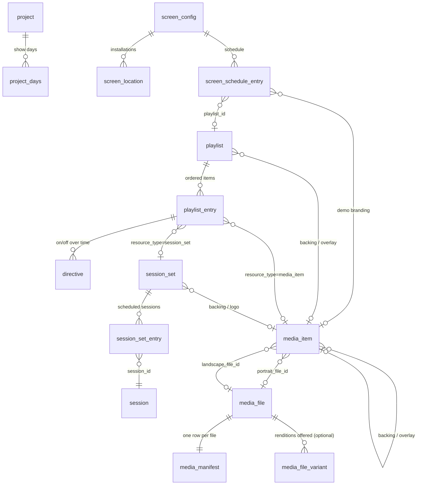
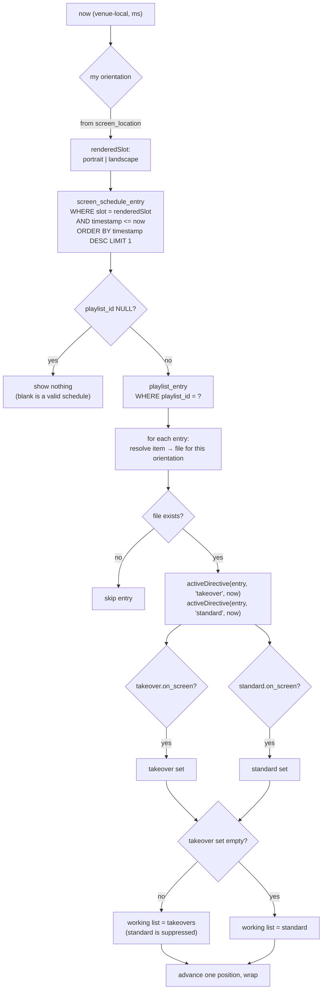
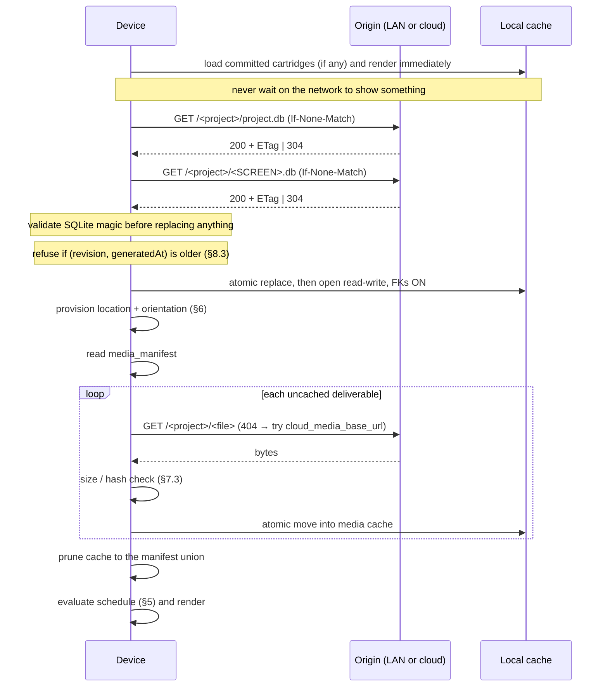

# Marquee Cartridge Specification

**The delivered-artifact contract for Marquee digital signage.** Marquee publishes a
show as self-contained SQLite *cartridges*; a player fetches them, resolves a schedule
from them, and renders. This repository specifies those artifacts precisely enough to
write a player on any platform.

The reference client is iOS/macOS. Nothing in the format requires it.

### Status

**Stable and in production.** The format described here is what ships to live venues
today. It evolves additively — see [The compatibility contract](#9-the-compatibility-contract),
which is the part that lets a cartridge published last year open in a client written
next year.

### A working example

**[Live reference client →](https://mountain-view-staging.github.io/marquee-cartridge-spec/example/)**

[`example/`](example/) is a complete player in one HTML file, reading two real
cartridges served from this repository. A static site is a complete Marquee
origin, so the demo needs no backend. It exercises the rules that are easiest to
get wrong — per-slot resolution, takeover suppression, day-scoped directives,
orientation fallback, and hash-less media — and [`build-demo.py`](example/build-demo.py)
rebuilds the whole show from scratch with no dependencies.

[`player/`](player/) is a **reference player** rather than an explorer: images and
video, one hard-coded cartridge, no chrome. Its resolution core
([`player.js`](player/player.js)) touches no DOM and is pure, so it is the part
to read when porting to another language.
**[Live player →](https://mountain-view-staging.github.io/marquee-cartridge-spec/player/)**

Planned next for this repository:

- a conformance fixture set
- reference client implementations in other languages

Corrections and questions are welcome as issues — particularly from anyone
implementing against this, since the gaps are easiest to see from outside.

---

# Client Implementer's Guide

**Audience:** developers building a Marquee playback client on a platform other than
iOS/macOS — Android, web, Linux/embedded, set-top, signage SoC.

**Scope:** the *delivered artifacts* only — the two SQLite files a device fetches and
the rules for interpreting them. This is **not** the Marquee authoring schema. An
authoring database has tables and columns a cartridge never carries, and a client must
never assume it can read one.

> **Status of this document.** Written 2026-09-18 against: the shared schema definition (migrations `v1-baseline` …
> `v4-entry-playback-states`), both publishers, and the reference client. Where the reference client does **not**
> yet implement something the schema describes, this document says so rather than
> implying the field is live. Those places are marked **⚠️ not honoured by the
> reference client**.

---

## 1. The shape of the system

A **show** (identified by a `projectCode`, also called the *show code*, e.g. `SHOW26`)
publishes a flat keyspace of files:

```
<base>/<projectCode>/project.db          ← the project cartridge  (always present)
<base>/<projectCode>/<SCREENCODE>.db     ← one screen cartridge per screen
<base>/<projectCode>/<deliverable>       ← media bytes, flat, UUID-named
```

A device is configured with a **three-level address**:

| level | example | meaning |
|---|---|---|
| `projectCode` | `SHOW26` | which show — finds the keyspace |
| `screenCode` | `LOBBY3` | which cartridge — names the `.db` |
| `locationId` | `LOBBY3` | which *installation* — chosen at provisioning, see §6 |

A client that has no screen targeted at it uses `project.db` alone and shows
wallpaper/date-time. A client with a screen code pulls **both** files: `project.db` is
always the project descriptor, and the screen cartridge carries the schedule.

### 1.1 Two producers exist

Cartridges in the field come from two publishers, and they do not populate the same
fields. **Your client must tolerate both.**

| | Swift Studio (macOS/iPad) | Legacy web Studio |
|---|---|---|
| `screen_location` | populated | **empty before 2026-09-18** (§6) |
| `media_manifest.content_hash` | SHA-256 present | **always NULL, by design** (§7.3) |
| `media_manifest.file_size` | present | present on newer rows only |
| `cartridge_meta.published_revision` | real monotonic counter | `0` before 2026-09-18 |
| `cartridge_meta.cloud_media_base_url` | `NULL` | an S3 base — **load-bearing**, see §7.2 |
| `playlist_entry` v4 columns | present | absent on cartridges published before 2026-09 |

None of these differences are errors. They are the reason §9 (the compatibility
contract) exists.

---

## 2. Byte-level facts

- Both artifacts are **plain single-file SQLite 3 databases**. No WAL, no `-shm`/`-wal`
  sidecars.
- Open **read-write** if you intend to add your own runtime tables (the reference client
  does, for file-availability bookkeeping). Adding tables is safe; the producer never
  reads the file back.
- **Do not run migrations against a cartridge.** It is a delivered artifact, not a
  database you own. A client on a newer schema that migrates in place will re-create
  tables the publisher deliberately dropped, or fail on a migration referencing one.
- **Open with foreign keys ON.** The publisher guarantees a clean
  `PRAGMA foreign_key_check` on every cartridge it writes. If yours fails, the file is
  damaged — do not commit it over the copy you already have.
- Row `id`s are **preserved from the authoring database**, not renumbered. They are
  stable across republishes, so they are safe to use as cache keys.
- Timestamps are **Unix milliseconds, integer**, unless a column says otherwise.
  Durations and trim offsets are **seconds, REAL**.
- Booleans are `INTEGER` `0`/`1`.

### 2.1 `grdb_migrations`

Both artifacts carry a `grdb_migrations` table: one `identifier TEXT` column, one row per
applied migration, in order.

```
v1-baseline
v2-media-variants
v3-media-optimization
v4-entry-playback-states
```

Use it to **detect** the producer's schema generation. Do not use it to decide whether to
read a column — probe the column (§9.2). A cartridge published today may carry only
`v1-baseline` and `v2-media-variants` and still be perfectly valid.

---

## 3. Which tables are in which artifact

### 3.1 `project.db` — the project cartridge

These tables, and **no `cartridge_meta`** (its absence is how you identify the file):

```
project   project_days   media_item   media_file   media_manifest   grdb_migrations
media_file_variant     ← optional — the renditions offered, §4.8
```

It carries the show's identity, timezone, days, and the wallpaper media closure.

### 3.2 `<SCREENCODE>.db` — the screen cartridge

```
cartridge_meta          media_manifest
project                 project_days
screen_config           screen_location        screen_schedule_entry
playlist                playlist_entry         directive
session                 session_set            session_set_entry
media_item              media_file
grdb_migrations
media_file_variant      ← optional — the renditions offered, §4.8
```

**Deliberately absent** (authoring-only — never expect them): `tag`, `tag_assignment`,
`integration`, `media_optimization`.

> `media_file_variant` was on that list until 2026-09. Cartridges from the Swift Studio now
> carry it; cartridges from the legacy web publisher do not. Handle both (§4.8).

A screen cartridge **also** carries `project` and `project_days`, so a client with a
screen cartridge can resolve time without opening `project.db`. But the screen
cartridge's `project` row has `show_wallpaper_item_id` and `desktop_wallpaper_item_id`
**forced to NULL** — wallpapers live only in `project.db`, because the screen cartridge
does not contain those media rows and a dangling pointer would fail
`foreign_key_check`.

### 3.3 Entity relationships



The chain a renderer actually walks is narrower than the diagram — see §5.

---

## 4. Table reference

DDL below is verbatim from the reference schema. Comments are the schema's own.

### 4.1 `cartridge_meta` — screen cartridges only, exactly one row

```sql
CREATE TABLE cartridge_meta (
  screen_id TEXT, project_code TEXT, published_revision INTEGER NOT NULL,
  show_wallpaper_item_id INTEGER, desktop_wallpaper_item_id INTEGER,
  cloud_media_base_url TEXT, timezone TEXT,
  generated_at INTEGER NOT NULL
);
```

| column | notes |
|---|---|
| `screen_id` | the screen code. **The discriminator** — non-NULL = screen cartridge. |
| `project_code` | the show code. Use for the media keyspace. |
| `published_revision` | monotonic per screen. **May be `0`** from the legacy producer. See §8.3. |
| `show_wallpaper_item_id`, `desktop_wallpaper_item_id` | always NULL here; read them from `project.db`'s `project` row. |
| `cloud_media_base_url` | a **second media home**, already project-scoped. See §7.2. |
| `timezone` | IANA identifier, e.g. `America/Los_Angeles`. The venue's timezone; evaluate all schedule rules in it. |
| `generated_at` | Unix ms the cartridge was produced. |

### 4.2 `media_manifest` — both artifacts, one row per media file

```sql
CREATE TABLE media_manifest (
  media_file_id INTEGER NOT NULL, deliverable_file_name TEXT NOT NULL,
  content_hash TEXT, file_size INTEGER, content_type TEXT NOT NULL
);
```

The complete list of bytes this cartridge needs. `deliverable_file_name` is the flat
object key — see §7.

> `content_hash` is **nullable by design** and `file_size` may also be absent. Read §7.3
> before writing any verification code.

### 4.3 `project` and `project_days`

```sql
CREATE TABLE project (
  id                        INTEGER PRIMARY KEY AUTOINCREMENT,
  cloud_uid                 TEXT    NOT NULL,
  name                      TEXT    NOT NULL,
  created                   INTEGER NOT NULL,
  updated                   INTEGER NOT NULL,
  retain_originals          INTEGER NOT NULL DEFAULT 1,
  timezone                  TEXT,
  project_code              TEXT,
  show_wallpaper_item_id    INTEGER REFERENCES media_item(id) ON DELETE RESTRICT,
  desktop_wallpaper_item_id INTEGER REFERENCES media_item(id) ON DELETE RESTRICT,
  edit_code_required        INTEGER NOT NULL DEFAULT 0
);

CREATE TABLE project_days (
  id         INTEGER PRIMARY KEY AUTOINCREMENT,
  day        TEXT    NOT NULL UNIQUE,   -- 'YYYY-MM-DD'
  start_time INTEGER NOT NULL,          -- unix ms, venue-local day start
  end_time   INTEGER NOT NULL,          -- unix ms, venue-local day end
  created    INTEGER NOT NULL,
  updated    INTEGER NOT NULL
);
```

`retain_originals` and `edit_code_required` are authoring concerns; ignore them.

**`project_days` is not decoration.** It defines the show's day windows, which scope
directive evaluation (§5.4) and drive preview-time projection (§8.2). Days are
**non-contiguous** — a show can skip a day. Order by `start_time`.

### 4.4 `screen_config`, `screen_location`, `screen_schedule_entry`

```sql
CREATE TABLE screen_config (
  id                 INTEGER PRIMARY KEY AUTOINCREMENT,
  name               TEXT    NOT NULL,
  revision           INTEGER NOT NULL DEFAULT 0,   -- monotonic; bumped on any schedule change
  archived           INTEGER NOT NULL DEFAULT 0,
  created            INTEGER NOT NULL,
  updated            INTEGER NOT NULL,
  screen_id          TEXT,
  published_revision INTEGER,
  published_at       INTEGER
);

CREATE TABLE screen_location (
  id                   INTEGER PRIMARY KEY AUTOINCREMENT,
  config_id            INTEGER NOT NULL REFERENCES screen_config(id) ON DELETE CASCADE,
  location_id          TEXT    NOT NULL UNIQUE,   -- globally unique real-world id
  orientation          TEXT    NOT NULL,          -- 'portrait' | 'landscape' (the mount)
  label                TEXT,
  last_checked_at      INTEGER,                   -- unix ms; "is it online?"
  last_pulled_revision INTEGER,                   -- vs config.revision; "needs update?"
  created              INTEGER NOT NULL,
  updated              INTEGER NOT NULL
);

CREATE TABLE screen_schedule_entry (
  id                 INTEGER PRIMARY KEY AUTOINCREMENT,
  config_id          INTEGER NOT NULL REFERENCES screen_config(id) ON DELETE CASCADE,
  slot               TEXT    NOT NULL,            -- 'portrait' | 'landscape' | 'demo_station'
  timestamp          INTEGER NOT NULL,            -- most-recent <= now wins, per slot
  playlist_id        INTEGER REFERENCES playlist(id)   ON DELETE RESTRICT,
  background_item_id INTEGER REFERENCES media_item(id) ON DELETE RESTRICT,
  overlay_item_id    INTEGER REFERENCES media_item(id) ON DELETE RESTRICT,
  created            INTEGER NOT NULL,
  updated            INTEGER NOT NULL,
  CHECK ( ... )                                   -- see §5.5
);
```

A screen cartridge carries **exactly one** `screen_config` row — its own.
`last_checked_at` / `last_pulled_revision` are server-side bookkeeping columns; a client
does not write them into the cartridge.

### 4.5 `playlist`, `playlist_entry`, `directive`

```sql
CREATE TABLE playlist (
  id                INTEGER PRIMARY KEY AUTOINCREMENT,
  name              TEXT    NOT NULL,
  shuffle           INTEGER NOT NULL DEFAULT 0,
  is_seamless_video INTEGER NOT NULL DEFAULT 0,
  backing_item_id   INTEGER REFERENCES media_item(id) ON DELETE RESTRICT,
  overlay_item_id   INTEGER REFERENCES media_item(id) ON DELETE RESTRICT,
  archived          INTEGER NOT NULL DEFAULT 0,
  created           INTEGER NOT NULL,
  updated           INTEGER NOT NULL
);

CREATE TABLE playlist_entry (
  id                   INTEGER PRIMARY KEY AUTOINCREMENT,
  playlist_id          INTEGER NOT NULL REFERENCES playlist(id) ON DELETE CASCADE,
  media_item_id        INTEGER REFERENCES media_item(id)  ON DELETE RESTRICT,
  session_set_id       INTEGER REFERENCES session_set(id) ON DELETE RESTRICT,
  position             INTEGER NOT NULL,
  created              INTEGER NOT NULL,
  updated              INTEGER NOT NULL,
  resource_type        TEXT    NOT NULL DEFAULT 'media_item',
  start_time_portrait  REAL,
  end_time_portrait    REAL,
  start_time_landscape REAL,
  end_time_landscape   REAL,
  -- added by v4-entry-playback-states; ABSENT in older cartridges
  loop_clip            INTEGER NOT NULL DEFAULT 0,
  pause_on_entry       INTEGER NOT NULL DEFAULT 0,
  pause_on_completion  INTEGER NOT NULL DEFAULT 0,
  disabled             INTEGER NOT NULL DEFAULT 0,
  CHECK (resource_type <> 'media_item'  OR media_item_id  IS NOT NULL),
  CHECK (resource_type <> 'session_set' OR session_set_id IS NOT NULL)
);

CREATE TABLE directive (
  id         INTEGER PRIMARY KEY AUTOINCREMENT,
  entry_id   INTEGER NOT NULL REFERENCES playlist_entry(id) ON DELETE CASCADE,
  type       TEXT    NOT NULL,   -- 'standard' | 'takeover'
  timestamp  INTEGER NOT NULL,
  on_screen  INTEGER NOT NULL,
  timezone   TEXT,
  created    INTEGER NOT NULL,
  updated    INTEGER NOT NULL
);
```

> **⚠️ The four v4 columns are the single most common way to break a client.** They were
> added with `NOT NULL DEFAULT 0`, which means *every cartridge published before them
> lacks those columns entirely*. A decoder that requires them throws on the whole table
> and the client sees an empty playlist — a black screen with nothing in any log naming
> the cause. This shipped to a live venue. Decode them as optional-with-default. See §9.
>
> They are **authoring/preview hints** and are **⚠️ not honoured by the reference
> client**. Ignore them unless you are deliberately implementing preview parity.

`shuffle`, `is_seamless_video` and `archived` on `playlist` are **⚠️ not honoured by the
reference client**.

### 4.6 `media_item`, `media_file`

```sql
CREATE TABLE media_item (
  id                INTEGER PRIMARY KEY AUTOINCREMENT,
  name              TEXT    NOT NULL,
  portrait_file_id  INTEGER REFERENCES media_file(id) ON DELETE RESTRICT,
  landscape_file_id INTEGER REFERENCES media_file(id) ON DELETE RESTRICT,
  display_duration  REAL,
  system_generated  INTEGER NOT NULL DEFAULT 0,
  audio_priority    TEXT,
  backing_item_id   INTEGER REFERENCES media_item(id) ON DELETE RESTRICT,
  overlay_item_id   INTEGER REFERENCES media_item(id) ON DELETE RESTRICT,
  archived          INTEGER NOT NULL DEFAULT 0,
  created           INTEGER NOT NULL,
  updated           INTEGER NOT NULL,
  CHECK (portrait_file_id IS NOT NULL OR landscape_file_id IS NOT NULL)
);
```

A **`media_item` is the orientation-independent thing an operator schedules.** It holds
up to two `media_file`s — one per orientation — and the client picks by the orientation
it is rendering (§5.6). At least one slot is always present.

`media_file` carries the physical asset. The columns a client needs:

| column | use |
|---|---|
| `source_file_name` | fallback deliverable name |
| `optimized_file_name` | **preferred** deliverable name when non-NULL |
| `content_type` | MIME. Drives image-vs-video. Video set: `video/mp4`, `video/quicktime`, `video/x-m4v` |
| `width`, `height` | intrinsic pixels — see §7.5 |
| `intrinsic_duration` | seconds, REAL. Video length; use as a playback watchdog |
| `thumbnail_file_name` | optional; **not** in the manifest, do not assume it is fetchable |
| `orientation`, `aspect_ratio` | advisory |
| `file_size`, `content_hash` | mirrored into the manifest; prefer the manifest's copy |

> **The deliverable name rule.** The object to fetch is
> `optimized_file_name ?? source_file_name`. The publisher has already folded the chosen
> variant into these columns, and `media_manifest.deliverable_file_name` is the same
> value. **Use the manifest.** Re-deriving it from `media_file` is a second
> implementation of one rule.

`archived` items still render when referenced — archive is an authoring-library concept,
not a delivery filter. Do **not** skip archived rows.

`audio_priority`, `system_generated` are **⚠️ not honoured by the reference client**.

### 4.7 `session`, `session_set`, `session_set_entry`

Carried in screen cartridges when a playlist entry has `resource_type = 'session_set'` —
a signage board of scheduled conference sessions rather than a media asset.

> **⚠️ Not rendered by the reference client.** The data is delivered and the seam exists,
> but no renderer consumes it yet. A conforming client may skip
> `resource_type = 'session_set'` entries entirely. If you implement them, treat the
> board layout as your own product decision; the cartridge carries content
> (`session_set_entry.start_time`/`end_time`, `session.name`/`presenters`/`abstract`) and
> branding pointers (`backing_item_id`, `logo_item_id`), not a layout.
>
> `presenters` and `attributes` are **JSON arrays stored as TEXT**. `render_modes` is a
> JSON array, default `["simple"]`. `schedule_template` is a JSON diff against a client
> baseline; absent means baseline.

---

### 4.8 `media_file_variant` — the renditions a client may choose from (optional)

```sql
CREATE TABLE media_file_variant (
  id            INTEGER PRIMARY KEY AUTOINCREMENT,
  media_file_id INTEGER NOT NULL REFERENCES media_file(id) ON DELETE CASCADE,
  kind          TEXT    NOT NULL,
  file_name     TEXT    NOT NULL,
  content_type  TEXT,
  width         INTEGER,
  height        INTEGER,
  file_size     INTEGER,
  content_hash  TEXT,        -- 'sha256:…' of THESE bytes, not the parent file's
  codec         TEXT,
  created       INTEGER NOT NULL,
  updated       INTEGER NOT NULL
);
```

**Present in cartridges from the Swift Studio; absent from cartridges the legacy web
publisher produces.** When present it lists every rendition of every media file the
cartridge carries, so a client can download the one it plays best rather than the one the
publisher picked. §7.6 is the algorithm.

| `kind` | what it is |
|---|---|
| `original` | the file as imported. Always offered: an editing client may want the pristine bytes, while a signage client normally prefers an optimized rendition. Offering is not recommending. |
| `optimized` | the venue master — visually lossless, Apple-native (HEVC video, HEIC stills). |
| `webOptimized` | browser-universal — H.264 video at up to 1080p, JPEG or PNG stills. |
| `wifiOptimized` | a smaller Apple-native rung for a weak uplink: a lower quality claim, not a better encode. Video only, and not every video has one. |

Only rows that carry a `content_hash` are offered. Ignore any `kind` you do not recognise
(§9.4) — more will appear.

`codec` names what a client must **decode**: `HEVC`, `H.264`, `ProRes` for video; `HEIC`,
`JPEG`, `PNG`, `WebP` for stills. It is the column to choose on. **For video,
`content_type` does not answer the question** — `video/mp4` holds HEVC or H.264, and the
container does not say which.

> ⚠️ **`media_manifest` does not change when this table is present.** It still names
> exactly one deliverable per media file — the `optimized` rendition where one exists,
> else the original — and `media_file`'s deliverable columns agree with it. A client that
> ignores this table plays exactly what it always played. That is deliberate: clients
> that predate the table download everything the manifest names, so the rendition list
> could never have gone there without multiplying every deployed device's downloads.

## 5. The resolution algorithm

This is the part to get right. Everything else is plumbing.



### 5.1 Pick the slot

Your **rendered slot** is `portrait` or `landscape`. There is no third rendering slot —
`demo_station` is a parallel overlay mode (§5.5), not an alternative to these.

Derive it from `screen_location.orientation` for the `location_id` this install is
provisioned to (§6). If the cartridge has no locations, fall back to your device default
— and see §6.1 for why that is the known failure mode.

### 5.2 Pick the schedule entry

Within your slot, the **most recent entry whose `timestamp <= now` wins**. Entries are a
timeline of changeovers, not a list of windows: there is no end time. The next entry in
the same slot supersedes this one.

```sql
SELECT * FROM screen_schedule_entry
 WHERE config_id = ?1 AND slot = ?2 AND timestamp <= ?3
 ORDER BY timestamp DESC LIMIT 1;
```

Compute your **next wake time** as the earliest `timestamp > now` across your slot *and*
`demo_station`, so a demo changeover wakes the scheduler as readily as a playlist one.

**A `playlist_id` of NULL is meaningful**: it means "show nothing from now". Clear the
active playlist; do not leave the previous one up.

### 5.3 Expand the playlist

Read every `playlist_entry` for that playlist. `position` is the authored order.

Drop an entry when:

- `resource_type = 'media_item'` **and** the item resolves to no file for your
  orientation (§5.6); or
- `resource_type = 'session_set'` and you do not implement session boards.

### 5.4 Apply directives — the on/off timeline

Each entry carries a `directive` timeline, in two independent types: `standard` and
`takeover`. A directive is a **state change**, not a window.

For one entry and one type, at time `now`:

1. Find the **day window** containing `now`: the `project_days` row where
   `now BETWEEN start_time AND end_time`.
2. Take that entry's directives of that type with `timestamp <= now`.
3. **If a day window was found**, keep only directives whose `timestamp` also falls
   inside that window.
4. The **latest** surviving directive wins. Its `on_screen` decides participation.
5. If `now` falls outside every day, or the cartridge has no `project_days`, the whole
   timeline participates (step 3 is skipped).

The day scoping is what makes ON-only chains day-part correctly: yesterday's takeover
cannot leak into today, because it is outside today's window — while any number of
takeovers *within* today form a fluid priority set.

```sql
-- one entry, one type, at :now, scoped to the day window if there is one
SELECT * FROM directive
 WHERE entry_id = :entry AND type = :type AND timestamp <= :now
   AND (:windowStart IS NULL OR timestamp BETWEEN :windowStart AND :windowEnd)
 ORDER BY timestamp DESC LIMIT 1;
```

`directive.timezone` is per-directive authoring context. Evaluate against the cartridge
timezone (§8.1); the column is informational.

### 5.5 Takeover beats standard, wholesale

Build two lists: entries whose governing `takeover` directive is ON, and entries whose
governing `standard` directive is ON. Then:

> **If the takeover list is non-empty, it IS the rotation. The standard list is
> suppressed entirely — not appended, not interleaved.**

This is how an operator cuts to emergency or sponsor content without editing the
playlist. When the takeover directives go OFF, the standard rotation resumes.

Advance by finding the entry you rendered last **in the current working list** and taking
the next position, wrapping at the end. If the last-rendered entry is no longer in the
list, start at position 0. **Do not keep a bare index** — the list is recomputed every
tick and its composition changes, so an index skips items.

If the working list is empty, keep the last frame up and retry in ~2 s rather than
stalling. Directive windows can legitimately empty the list for a moment.

#### The demo station slot

`slot = 'demo_station'` is resolved the same "latest ≤ now" way, in parallel with your
rendering slot. Its `CHECK` constraint encodes the rules:

- `portrait`/`landscape` entries carry **only** a playlist — never branding.
- `demo_station` entries carry branding (`background_item_id`, optional
  `overlay_item_id`) and **may also** carry a `playlist_id` — picture-in-picture
  content, rendered at the **opposite** orientation to the host.
- An all-NULL `demo_station` entry means **demo off**.

Identify a demo entry by its `slot`, never by "it has no playlist". If you do not
implement demo mode, ignore the slot entirely — it never affects `portrait`/`landscape`
resolution.

### 5.6 Item → file, by orientation

```
portrait  → portrait_file_id  ?? landscape_file_id
landscape → landscape_file_id ?? portrait_file_id
```

Fall back to the other orientation; never render nothing when one slot is filled. An
entry whose item resolves to no file at all is dropped in §5.3.

Then, if the cartridge offers renditions, choose which one of that `media_file` to fetch
and play — §7.6. A client that ignores renditions uses the file as the manifest names it.

### 5.7 Start and duration

Each entry resolves to a **start** and a **duration**, in seconds, for the orientation
being rendered. They are the numbers Studio's editor shows as a row's Start and running
time, so a player that follows this rule shows what the operator saw there.

| | rule |
|---|---|
| **start** | the entry's `start_time_<orientation>`, else `0` |
| **duration** | `end_time_<orientation> − start` when the window has an end — **for a still too**, where the end is its dwell override · a video with no end: **to the end of the clip** · a still with no end: `media_item.display_duration`, else **8 s** |

- For a video, start is the in-point and start + duration the out-point.
- A window counts only when `end > start`. Studio refuses any other, and a zero-length
  hold on a still would spin the rotation.
- Keep a watchdog so one clip that never ends cannot park the rotation: the duration
  when there is one, else `intrinsic_duration`, else 300 s — plus a 10 s grace.

> **⚠️ The iOS/macOS client does not honour the window or `display_duration` yet.** It
> holds every still for 8 s and plays every clip in full. The reference web player
> (`player/`) follows the rule above. Until the Apple client catches up, two screens
> playing the same cartridge differ in timing wherever a show sets these fields.

### 5.8 ⚠️ Content types you must expect

`media_file.content_type` is stored **verbatim from whatever the operator uploaded**.
The two producers do not agree on the set:

| | accepts at import | so a cartridge may carry |
|---|---|---|
| Swift Studio | png, jpeg, **webp**, heic, mp4, quicktime, x-m4v | those seven |
| Legacy web Studio | png, jpeg, **gif**, **webp**, svg→png, pdf→png, mp4 | png, jpeg, **`image/gif`**, **`image/webp`**, mp4 |

The reference client classifies by a fixed enum and treats anything outside it as
unplayable — so a legitimately published asset of an unlisted type is **skipped on every
rotation**, leaving an empty slot with no operator-visible cause.

**`image/webp` was in that hole until 2026-09-19** and is now supported. Worth keeping as
the worked example, because the shape is what matters: Apple's ImageIO had decoded WebP
since macOS 11 all along, so nothing about the *platform* was missing — an enum simply did
not list it, and the cost was a silent skip rather than an error.

**`image/gif` is still in that hole.** A GIF published by the web Studio is skipped today.

For a new client:

- **Treat any `image/*` you can decode as an image, and any `video/*` you can decode as a
  video.** Do not hard-code an allow-list; you will inherit this bug.
- When you genuinely cannot decode a type, **say which file and which type**, loudly
  enough that an operator sees it without reading a device log. A silently skipped asset
  is the single most expensive failure mode in this system — it looks identical to
  "everything is fine" from every angle except the wall.
- **Where the cartridge offers renditions, decide on `codec`, not `content_type`** (§4.8).
  It is the only column that separates an HEVC `video/mp4` from an H.264 one.

---

## 6. Provisioning

A screen cartridge may describe several **installations** of the same screen:
`screen_location` rows sharing one `config_id`. They all play the same cartridge; each is
tracked separately by its `location_id`.

On first run:

1. Read the cartridge's `screen_location` rows.
2. Pick one — present the list (`label`, `orientation`) or take the first.
3. **Persist the chosen `location_id`.**
4. Adopt that location's `orientation` as your rendering slot.

On subsequent runs, prefer the stored `location_id`, but **only while the cartridge still
lists it**. If it is gone (renamed or deleted in Studio), re-pick — otherwise the device
resolves no orientation forever and checks in for a location the server does not have.

Clear the stored `location_id` whenever the configured `projectCode` **or** `screenCode`
changes: locations are rows of *that* screen's cartridge.

### 6.1 ⚠️ The empty-`screen_location` failure

Legacy cartridges published before 2026-09-18 carry **zero** `screen_location` rows. A
client then has no orientation to adopt and falls back to its own default. If that
default is `portrait` and the cartridge's only schedule entries are in the `landscape`
slot, **§5.2 matches nothing, no playlist is selected, and the screen is black** — while
sync reports complete success.

Handle it explicitly:

- Log the absence in a way an operator can find. Silence here costs a venue call.
- Provide a manual orientation override, and make it take effect immediately
  (re-evaluate §5.2 on change rather than waiting for the next schedule boundary).
- When a location *does* arrive in a later publish, adopting its orientation is correct —
  but do not stomp a manual override on every unrelated republish. Remember the last
  orientation you adopted from a cartridge and act only when that value *changes*.

---

## 7. Media

### 7.1 Addressing

```
<mediaBase>/<projectCode>/<deliverable_file_name>
```

Flat, per project. `deliverable_file_name` comes from `media_manifest` — or, where you chose
a rendition (§7.6), use that rendition's `file_name` in its place. Renditions live in the
same flat keyspace and are addressed identically. Names are UUID-unique and immutable — a
re-optimize mints a *new* name — so **presence by name is a sufficient "already have it"
check**. Cache on name, not on hash.

Prune your cache against **what you play, plus what you are still fetching**: the
manifest entries of the cartridges you currently hold, each replaced by the rendition you
play where you chose one, plus any rendition still downloading (§7.6). A client that
chooses renditions and then prunes against the raw manifests deletes the files it chose;
one that prunes against only what it fetches deletes the file it is still playing while
an upgrade downloads.

### 7.2 ⚠️ Two homes, and when to try the second

`cartridge_meta.cloud_media_base_url`, when non-NULL, is a **second, complete media
home** — and it is **already project-scoped** (it ends in the producer's own project
identifier). Append the file name alone:

```
primary:  <mediaBase>/<projectCode>/<deliverable_file_name>
fallback: <cloud_media_base_url>/<deliverable_file_name>      ← no projectCode
```

Legacy shows uploaded media to their own bucket and were only later mirrored into the
show-code keyspace. A show published before that mirror has a manifest the primary home
404s on and a `cloud_media_base_url` that resolves every file. Without the fallback such
a show caches **0 of N** and the device shows nothing.

**Only a 404 means "try the other home."** A 403 or a 5xx is *this* home failing, and
silently retrying elsewhere hides it.

### 7.3 ⚠️ Integrity: the hash is optional, the size is what you have

`media_manifest.content_hash` is **NULL by design** for legacy-published shows. There is
no hash to check against, and rejecting those files rejects the entire show.

The rule:

1. If `file_size` is present and the downloaded length differs → **reject**.
2. If `content_hash` is present and does not match → **reject**.
3. If neither is present → **admit the file, and count it.**

Report the unverified count to the operator (the reference client says
`… · 86 UNVERIFIED (no hash in the manifest — legacy cartridge)`). Admitting silently and
rejecting wholesale are both wrong; admitting *audibly* is right.

A rendition (§4.8) carries its **own** `content_hash` and `file_size`. Verify a chosen
rendition against those, never against its parent file's — the right bytes under the
parent's hash fail every download.

Keep the two rejections distinguishable. A size mismatch is usually a truncated transfer
— worth retrying. A hash mismatch means the bytes at that address are not the bytes the
cartridge was built from — retrying will not help. One message for both sends people
hunting the wrong thing.

### 7.4 Resumable fetching (recommended)

Both cloud homes answer ranged GETs (`206`, `Accept-Ranges: bytes`, `Content-Range`,
`ETag`). For video-heavy shows on a venue uplink this is the difference between slow and
never: every whole-file attempt is long enough to be interrupted, so every attempt is.

If you implement it, two rules are not optional:

1. **Store the origin's `ETag` beside the partial, and write the validator *before* the
   bytes it describes.** A crash between them costs one chunk; bytes that outlive their
   validator are indistinguishable from a stale partial.
2. **No validator, or a mismatched one → discard and start clean.** Never append to bytes
   whose identity you cannot prove.

Under §7.3 there is often no whole-file hash to catch a bad splice, so the validator is
the *only* thing standing between a resume and a file of exactly the right length and
entirely the wrong content.

Keep partials **outside** the directory your renderer resolves media from, and treat a
404 at one home as "not at this address" — it says nothing about the other home, so it
must not delete a partial the other home would have resumed.

### 7.5 ⚠️ Renderer limits are yours to enforce

`media_file.width`/`height` are the intrinsic pixels. A cartridge may legitimately
contain assets larger than your renderer can texture (the reference client's ceiling is
3840 px on the long edge; assets at 2344×4184 have shipped).

**Downscale to fit. Do not silently skip.** A skipped asset is an empty slot every
rotation with nothing in any log — sixteen of nineteen assets playing and no way to tell
why. Keep a hard ceiling for safety, but make the failure mode "scaled" rather than
"absent", and say so at `notice` level when you scale.

---

### 7.6 Choosing a rendition

When the cartridge carries `media_file_variant` (§4.8), a client may download a rendition
in place of the manifest's deliverable. The reference client's order — the first one it
can decode wins:

1. `wifiOptimized`, **if the device is set to prefer it.** A weak uplink is a fact about
   where a device is installed, not about the show, so this is a device setting.
2. **The venue master: `optimized` when the file has one, else `original`.** A file with
   no `optimized` rendition is either one whose original was already the best deliverable,
   or one not yet optimized. In both cases the manifest names the original, so this matches
   a client that ignores the table. "Optimized, else web" — the obvious order — would drop
   an Apple device to the 1080p web rendition on exactly those files.
3. `webOptimized`.
4. `original`, as a last resort.

What makes that order safe:

- **Decide on `codec`.** A rendition with no `codec` is not known to be decodable, except
  a still, whose `content_type` names its encoding unambiguously. Never infer a video codec
  from `video/mp4`.
- **Only rows with a `content_hash` are candidates.** You verify before you use (§7.3); a
  hash-less rendition would be chosen and then refused.
- **Media only.** Brand delivery — typefaces and a style manifest — is not decoded as
  media. Take it exactly as the manifest names it.
- **Render only what you hold, and prune from the same decision you render from** (§7.1).
  A client that downloads one rendition and resolves another plays nothing.
- **When nothing offered for a file decodes, keep the manifest's deliverable and report the
  file and the codecs it offered.** Never end up holding fewer files than the cartridge
  shipped: dropping the file turns an unplayable asset into a silent gap on the wall.

#### Play what you hold

The order above is what to **fetch** when a client holds nothing for a file. A client that
already holds a verified rendition should not treat it as a command:

- **Going down a tier needs no download.** A client holding a rendition at or above the
  tier it now prefers keeps playing it and fetches nothing. Turning a WiFi preference on
  with the master already on disk costs no bytes and loses no quality.
- **Going up a tier replaces — once the new bytes are verified.** A client that prefers a
  higher tier than it holds fetches the preferred rendition and keeps playing the one it
  holds until then. If the download fails, the held rendition keeps playing and the fetch
  is retried; nothing that was playable is lost.
- **Tiers, highest first:** the master — `optimized` and `original`, one tier, because
  the optimized rendition is a visually-lossless re-encode of its original — then
  `wifiOptimized`, then `webOptimized`. When a client holds two in one tier it plays
  `optimized`. A held rendition counts only if the client can decode it, it has a
  `content_hash`, and the cartridge still offers it: a name the current cartridge no longer
  lists has no hash to verify against.

The tiers are not the fetch order. That order answers what to download, and lists
`original` last only because it is the fallback when nothing better decodes.

**A browser client should treat HEVC as undecodable unless it has probed the platform.**
HEVC support in a browser depends on the operating system, the hardware and the build.
H.264, JPEG, PNG and WebP are the safe set.

## 8. Time

### 8.1 Evaluate in venue-local time

Use `cartridge_meta.timezone` (screen cartridge) or `project.timezone` (project
cartridge) — an IANA identifier. All `timestamp`, `start_time`, `end_time` values are
absolute Unix ms, so comparison is timezone-free; the timezone matters for *presenting*
times and for the day projection below.

### 8.2 Synthetic time (preview outside the show window)

When the real clock falls **outside** the show — before the first day's `start_time` or
after the last day's `end_time` — the reference client projects the operator's wall-clock
**H:M:S onto Day 1's date** in the event timezone, and evaluates the schedule at that
projected instant. If the projection still lands outside the window, it clamps to
`eventStart`.

This only runs when the cartridge has `project_days`. Its purpose is that a screen
powered up the week before a show demonstrates its opening state instead of showing
nothing.

This is a **client behaviour, not a data rule** — you may reasonably choose to show a
"show has not started" state instead. Just decide deliberately: doing neither means a
blank screen during setup, which reads as a broken device.

### 8.3 Freshness: when to re-pull

Two mechanisms, depending on the origin:

**Cloud (static bucket):** conditional GET on the cartridge itself. Store the `ETag`,
send `If-None-Match`, treat `304` as "unchanged, keep what you have".

**LAN server:** a tiny status JSON at `<base>/<projectCode>/<fileName>/status`:

```json
{ "projectCode": "SHOW26", "screenId": "LOBBY3", "isProjectOnly": false,
  "generatedAt": 1789340889665, "publishedRevision": 3, "mediaFileCount": 98 }
```

Poll every 30–60 s. **Compare for inequality, never for order.** Cache the last status and
re-pull when *either* token differs.

`generatedAt` is a wall clock and is not monotonic across two publishers, a clock step, or
a cloud pull. `publishedRevision` is monotonic per screen but bumps only on schedule
edits, so a same-revision republish is real.

**Refusing an older cartridge.** Before committing a freshly pulled cartridge over one you
already hold, compare `(published_revision, generated_at)` lexicographically and keep the
current content if the new one is strictly older. Note that legacy publishers emit
`published_revision = 0` for every cartridge, which makes that gate rest entirely on
`generated_at` — a clock skew on the publishing machine is then the only thing between a
republish and a device that refuses it. Log loudly when you refuse.

### 8.4 Bootstrap sequence



**Never replace a good cartridge with an unvalidated body.** A captive portal answers 200
with an HTML login page. Check the 16-byte SQLite magic (`SQLite format 3\0`) before the
atomic swap — a zero-byte file is a *valid empty database*, so "it opens" is not enough.

A missing media file must degrade the count, never fail the bootstrap. Remember what
failed and retry it on later passes.

---

## 9. The compatibility contract

> **A record that reads a delivered artifact is a WIRE FORMAT, not a schema.**

Cartridges are published once and read by whatever client turns up later — including
clients older than the cartridge and clients newer than it. This section is the whole
reason the rest works.

### 9.1 Producers may only add

New columns are added **nullable, or `NOT NULL` with a `DEFAULT`**. Columns are never
removed, renamed, reordered, or retyped. Migration identifiers are append-only and a
shipped migration's SQL is never edited — deployed databases record only identifiers.

### 9.2 Consumers must tolerate absence

**Decode every column that is not part of the original baseline as
optional-with-default.** In practice: probe `PRAGMA table_info(<table>)` once per opened
cartridge and build your row mapper from what is actually there, or use a decoder whose
"missing column" behaviour is a default rather than an error.

The failure this prevents is specific and expensive: a strict decode of a column that
does not exist throws for the **whole table**, the caller sees an empty list, and the
device reports "no content" for a show whose rows are all present. It reached a live
venue. The four `playlist_entry` v4 columns are the known instance; they will not be the
last.

### 9.3 Never let a read failure look like empty

If a table fails to decode, **say so** — distinctly from "this table has no rows". Those
are different facts about the world and they lead to opposite investigations. Swallowing
the difference is what turned a one-line decode bug into an unexplained black screen.

### 9.4 Ignore what you do not understand

Unknown tables, unknown columns and unknown `resource_type` / `slot` / `type` values must
be skipped, not treated as errors. Forward compatibility is a client obligation.

### 9.5 A new table must be safe to ignore

When a producer adds a table a client may use — `media_file_variant` is the instance — the
tables a client already reads keep their meaning. A client that has never heard of the new
table still plays the cartridge correctly, and a client that uses it still plays a
cartridge without it. Tell the two apart as §9.3 requires: an absent table is not a table
that failed to decode.

---

## 10. Conformance checklist

A client is conforming when all of these hold.

**Artifacts**
- [ ] Opens both artifacts read-write with foreign keys ON, and never migrates them.
- [ ] Identifies a project cartridge by the **absence of `cartridge_meta`**.
- [ ] Validates the SQLite magic before replacing a committed cartridge.
- [ ] Refuses a cartridge older than the committed one by `(published_revision, generated_at)`, and logs the refusal.

**Compatibility**
- [ ] Decodes a cartridge whose `playlist_entry` lacks the four v4 columns, and renders it.
- [ ] Reports a table that failed to decode differently from a table that is empty.
- [ ] Ignores unknown tables, columns, and enum values.

**Resolution**
- [ ] Picks the schedule entry as latest-`timestamp`-≤-now **within its own slot**.
- [ ] Treats a NULL `playlist_id` as "show nothing".
- [ ] Scopes directives to the containing `project_days` window, and skips that scoping when outside all days.
- [ ] Suppresses the standard rotation entirely while any takeover is ON.
- [ ] Advances by locating the last-rendered entry in the recomputed list, not by a stored index.
- [ ] Falls back to the other orientation's file when its own slot is empty.
- [ ] Renders archived `media_item`s that are referenced.

**Provisioning**
- [ ] Persists `location_id`; re-picks when it leaves the cartridge; clears it when the address changes.
- [ ] Surfaces an empty `screen_location` to the operator and offers a manual orientation override that applies immediately.

**Media**
- [ ] Caches by file name and prunes to what it chose to hold (§7.1).
- [ ] Falls back to `cloud_media_base_url` **on 404 only**.
- [ ] Admits a hash-less file, counts it, and reports the count.
- [ ] Rejects a size mismatch and a hash mismatch with **different** messages.
- [ ] Downscales an oversized asset instead of skipping it, and says so.
- [ ] Degrades the media count on a missing file without failing the bootstrap.

**Renditions** (§4.8, §7.6)
- [ ] Plays a cartridge with no `media_file_variant` exactly as its manifest names.
- [ ] Chooses on `codec`; never infers a video codec from `content_type`.
- [ ] Verifies a chosen rendition against its **own** hash and size.
- [ ] Renders and prunes from the **same** decision, and never renders a rendition it
      does not hold.
- [ ] Holding a rendition at or above the tier it prefers, fetches nothing; going up a
      tier, keeps playing what it holds until the new bytes are verified.
- [ ] Reports a file none of whose renditions it can decode — by file and offered codec —
      and keeps the manifest's deliverable rather than dropping it.

---

## 11. Worked example

From a real cartridge that ran a live event, trimmed to four entries and with
identifiers replaced. `PRAGMA foreign_key_check` clean; `grdb_migrations` = `v1-baseline`,
`v2-media-variants` (i.e. **pre-v4** — no playback-state columns).

```
cartridge_meta
  screen_id            LOBBY3
  project_code         SHOW26
  published_revision   0                    ← legacy producer
  cloud_media_base_url https://legacy-media.example.net/1786977639120
  timezone             America/Los_Angeles
  generated_at         1789340889665

project_days           3 rows, 2026-09-15 … 2026-09-17
screen_config          1 row,  id 1789334727168, screen_id LOBBY3
screen_location        0 rows                ← §6.1 applies
screen_schedule_entry  1 row,  slot 'portrait', timestamp 1789455600000,
                               playlist_id 1788222671798
playlist_entry         4 rows
directive             12 rows (3 per entry, all type 'standard')
media_manifest         4 rows, content_hash NULL on all four,
                               file_size present on two
```

Resolving at `now = 1789460000000` (Day 1, after the changeover):

1. **Slot** — no `screen_location`, so the client falls back to its default. A
   portrait-defaulting client matches the `portrait` entry and works; a
   landscape-defaulting one matches nothing and shows black. This is exactly §6.1.
2. **Schedule** — the single `portrait` row has `timestamp <= now` → playlist
   `1788222671798`.
3. **Entries** — four, each resolving to a `media_item` with a `portrait_file_id`.
4. **Directives** — `now` falls inside Day 1, so only directives timestamped within Day 1
   participate. The latest `standard` per entry is ON → all four join the rotation. No
   `takeover` rows exist, so the takeover list is empty and standard governs.
5. **Files** — each item's `portrait_file_id` → `media_file` → manifest's
   `deliverable_file_name`, e.g. `3f477980-6c0e-47ca-955d-3c73855a941e.png`.
6. **Bytes** — the primary home 404s for this legacy show; every file resolves from
   `cloud_media_base_url` with the file name appended and no project code. All four are
   admitted **unverified** (no hash), two of them with a size check.

---

## 12. Glossary

| term | meaning |
|---|---|
| **cartridge** | a delivered, self-contained SQLite artifact for one screen |
| **project cartridge** | `project.db` — show identity, days, wallpapers; no `cartridge_meta` |
| **show code / `projectCode`** | the show's public identifier and media keyspace root |
| **screen code** | names the cartridge file; `PROJECT` is reserved |
| **location** | one physical installation of a screen; carries the mount orientation |
| **slot** | `portrait` \| `landscape` \| `demo_station` — schedule entries are scoped per slot |
| **directive** | a timestamped on/off state change for one playlist entry, in one of two types |
| **takeover** | a directive type that, while ON for any entry, replaces the standard rotation |
| **rendition** | one encoding of a media file — original, optimized, web, WiFi; a client chooses among those a cartridge offers (§7.6) |
| **tier** | a rendition's quality class, for deciding whether what a client holds is good enough: master (`optimized`, `original`) › `wifiOptimized` › `webOptimized` (§7.6) |
| **deliverable** | the media object actually fetched: `optimized_file_name ?? source_file_name` |
| **wire format** | a record that reads a delivered artifact; additive changes only |
